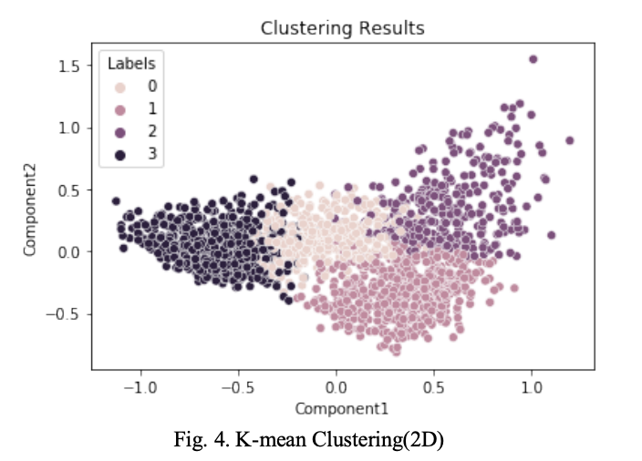
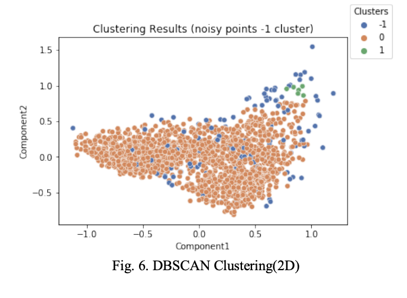
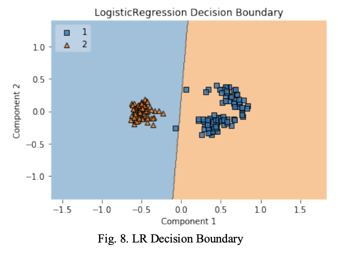
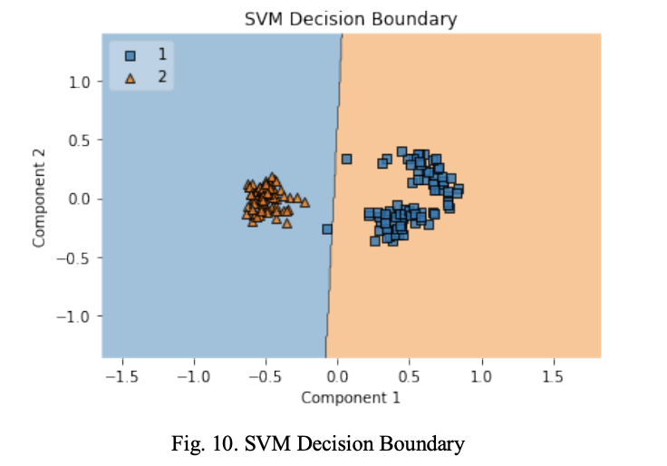

# Comparative Analysis of Clustering and Classification Algorithms in Data Mining

## Authors
- Dino Huang

## Abstract
This study explores four common methods in data prospecting: two types of cluster analysis (K-means and DBSCAN) and two types of classification analysis (logistic regression and SVM). The objective is to address clustering and classification problems in data mining.

## Keywords
data mining, k-means, DBSCAN, logistic regression, SVM

## Introduction
The project focuses on cluster and classification analytics. We delve into K-means and DBSCAN for cluster analysis and logistic regression and SVM for classification, addressing the challenges and peculiarities of each method.

## Pre-processing
Data pre-processing includes cleaning, standardizing, and dimensionality reduction using Principal Component Analysis (PCA).

### Data Cleaning
- Dataset 1: Normal distribution, no missing values, significant multicollinearity addressed with PCA.
- Dataset 2: Early records removed due to lack of comparability, normalization and PCA applied due to collinearity.

### Principal Component Analysis (PCA)
PCA was used to reduce dimensionality while preserving data variance. Explained variances for clustering and classification datasets were examined to determine the final dimensionality.

## Clustering
The essay explores K-means and DBSCAN for cluster analysis. K-means, a partitioning method, and DBSCAN, a density-based method, are applied to address unsupervised learning problems.

### K-means
K-means clustering’s effectiveness is explored using the elbow method for determining the optimal number of clusters.

### DBSCAN
DBSCAN's ability to identify clusters of any shape without pre-specified cluster numbers is demonstrated.

## Classification
Classification algorithms, logistic regression and SVM, are applied. Their unique approaches in dealing with data points relevant to classification are discussed.

### Logistic Regression (LR)
The LR model's performance is evaluated with a confusion matrix, and its decision boundaries are visualized.

### Support Vector Machine (SVM)
SVM's effectiveness in creating a categorical hyperplane is assessed, along with its decision boundaries.

## Conclusion
The study compares and contrasts different clustering and classification algorithms. The effectiveness of each method in the context of the provided datasets is discussed.

## Visualizations and Results

### Clustering Results
- 
- 

### Classification Results
- 
- 

## References
- A comprehensive list of references is included, ranging from Ay et al. (2023) on K-means to Wu et al. (2022) on DBSCAN.

## Appendices
- Appendix A: Correlation diagrams for cluster and classification datasets.
- Appendix B: Code snippets for clustered data analysis.
